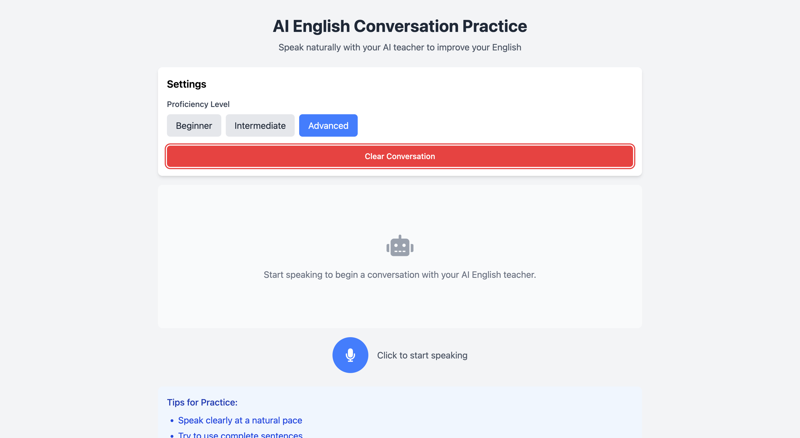

# AI English Teacher

## 📁 Project Structure

```bash
.
├── img          # Image for readme
├── frontend     # Vite + React + TypeScript frontend
└── server       # Backend powered by vLLM, managed via uv
```

This repository contains a project for building an AI-powered English teacher. The system consists of:

- **Frontend**: Built with Vite, React, and TypeScript
- **Backend**: Powered by `vLLM` and managed using the `uv` package manager



## 🚀 How to Run the Project

### 1. Launch the Backend (Server)

The server is responsible for running the LLM using vLLM. It is managed with the `uv` package manager.

#### Steps to set up the server:

```bash
cd server
uv venv
source .venv/bin/activate
uv sync
```

After setup, start the server with

```bash
uvicorn scripts.main:app --host 0.0.0.0 --port 8000
```

> **Note**:
> Be sure to specify the correct LLM model.
> Go to server/scripts/main.py and set the MODEL_PATH to the desired model.

### 2. Launch the Frontend

The frontend is built using Vite, React, and TypeScript.

```bash
cd frontend
npm install
npm run dev
```

## 🎙️ How to Use

Once the frontend is running, you'll see three buttons that allow you to choose the **difficulty level** of the AI assistant.

### 🗣️ Speaking to the AI

1. Click the **mic button** to start speaking in English.
2. Speak your sentence or question clearly.
3. Click the mic button again to stop recording.

Your voice will be sent to the server for processing. The server will transcribe your speech and generate a response using the LLM.

### 💬 Viewing and Hearing the Response

- The AI's response will appear in **chat format** on the screen.
- A **play button** will be shown next to each response.
- Click the play button to hear the **synthesized voice** of the AI reading the response aloud.

This setup combines speech recognition, LLM interaction, and text-to-speech to provide an interactive English learning experience.
